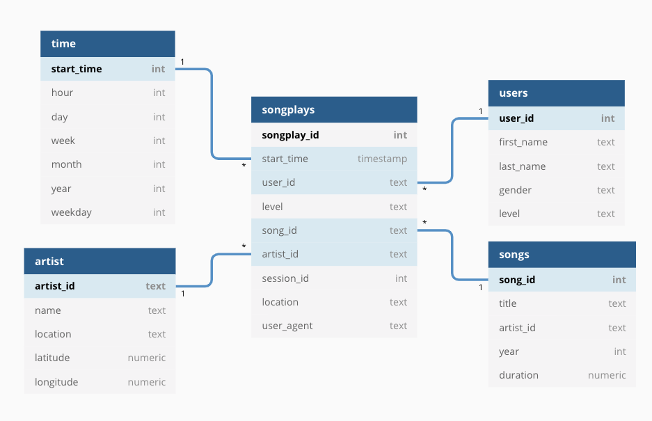

# Data Lakes with Spark Project

## Summary
This project is part of the Data Engineering Nanodegree.
A music streaming startup, Sparkify, has grown their user base and song database even more and want to move their data warehouse to a data lake. Their data resides in S3, in a directory of JSON logs on user activity on the app, as well as a directory with JSON metadata on the songs in their app.

## Database Desing
A star schema was optimized for queries on song play analysis.
* Fact Table:
    - songplays - records in log data associated with song plays
* Dimension Tables:
    - users - users in the app
    - songs - songs in the database
    - artists - artists in the music database
    - time - timestamps of records in songplays broken into specific units

    
